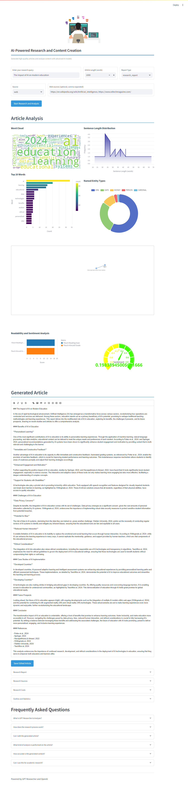

## 🔍 AI-Powered Research and Content Creation & Analysis Tool

GPT Researcher & Analyzer is an advanced Streamlit application that leverages the power of GPT Researcher to conduct research, and openai to  generate articles, and provide in-depth content analysis. This tool is perfect for researchers, writers, and anyone looking to quickly gather information and insights on a specific topic.



## ✨ Features

- **AI-Driven Research**: Utilizes GPT-4 to conduct comprehensive research on any given topic.
- **Article Generation**: Automatically creates well-structured, informative articles based on the research.
- **Rich Text Editing**: Includes a Quill editor for easy modification of the generated content.
- **Advanced Text Analysis**:
  - Word frequency analysis with interactive word cloud
  - Sentence length distribution visualization
  - Named Entity Recognition (NER)
  - Readability scoring (Flesch Reading Ease and Flesch-Kincaid Grade)
  - Sentiment analysis
  - Topic modeling with network visualization
  - Text summarization
- **Interactive Visualizations**: Utilizes Plotly, Altair, and ECharts for engaging data representations.
- **Customizable Research Parameters**: Options for report type, word count, and source selection.
- **Expandable Sections**: Detailed views of the research report, sources, and analysis results.

## 🛠 Installation

1. Clone the repository:
   ```
   git clone https://github.com/RaheesAhmed/pro-article-writter.git
   cd pro-article-writter
   ```

2. Create a virtual environment and activate it:
   ```
   python -m venv venv
   source venv/bin/activate  # On Windows, use `venv\Scripts\activate`
   ```

3. Install the required packages:
   ```
   pip install -r requirements.txt
   ```

4. Download the spaCy English model:
   ```
   python -m spacy download en_core_web_sm
   ```
  

5. Set up your environment variables:
   Create a `.env` file in the project root and add your API keys:
   ```
   OPENAI_API_KEY=your_openai_api_key_here
   TAVILY_API_KEY=your_tavily_api_key_here
   ```


## 🚀 Usage

1. Run the Streamlit app:
   ```
   streamlit run app.py
   ```

2. Open your web browser and navigate to the URL provided by Streamlit (usually `http://localhost:8501`).

3. Enter your research query, select the desired report type, and adjust other parameters as needed.

4. Click "Start Research and Analysis" to begin the process.

5. Once complete, explore the generated article, analysis visualizations, and additional information in the expandable sections.

6. Edit the article using the Quill editor if desired, and save your changes.

## 📊 Analysis Components

- **Word Cloud**: Visual representation of the most frequent words in the article.
- **Top 20 Words**: Bar chart showing the most common words and their frequencies.
- **Sentence Length Distribution**: Area chart displaying the distribution of sentence lengths.
- **Named Entity Types**: Pie chart of the types of named entities found in the text.
- **Topic Network**: Interactive network graph showing relationships between identified topics.
- **Readability Scores**: Bar chart of Flesch Reading Ease and Flesch-Kincaid Grade scores.
- **Sentiment Analysis**: Gauge chart indicating the overall sentiment of the article.

## 🤝 Contributing

Contributions, issues, and feature requests are welcome! Feel free to check the [issues page](https://github.com/RaheesAhmed/pro-article-writter.git/issues).

## 📝 License

This project is [MIT](https://choosealicense.com/licenses/mit/) licensed.

## 🙏 Acknowledgements

- [OpenAI](https://openai.com/) for the GPT-4 model
- [Streamlit](https://streamlit.io/) for the web app framework
- [Plotly](https://plotly.com/), [Altair](https://altair-viz.github.io/), and [ECharts](https://echarts.apache.org/) for data visualization
- All other open-source libraries used in this project

---

Made with ❤️ by Rahees Ahmed